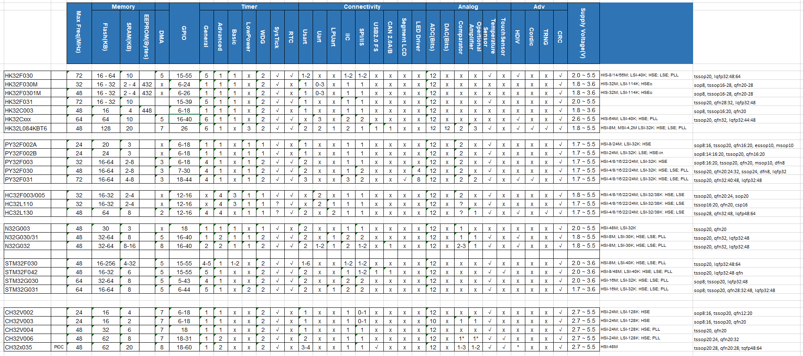
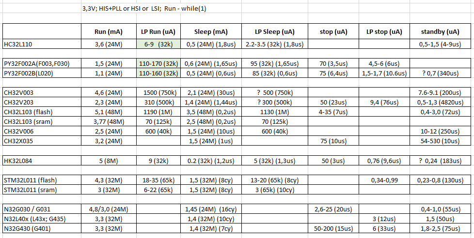

## MCU 32-bit  Review

Небольшой обзор 32-бит микроконтроллеров.  /хобби такое - не профессионал/<br>
Собственные тесты и описание особенностей.<br>
Большинство периферии совпадает с STM32, а также развитие дальше чем у STM32.<br>
Но есть много совсем оригинальных решений.
(CH32,PY32,HC32,N32,AT32,STM32, ...)<br>
(RISC-V, Cortex-M0,M0+,M3,M4,M4F, ...)

```
Каталоги
  boot - прошивки bootloader из микроконтроллеров
  bin  - прошивки найденные в микроконтроллерах в основной Flash
  //  по возможности будут расшифровки ( постепенные )
```

[Сводная таблица по параметрам микроконтроллеров](https://docs.google.com/spreadsheets/d/1Efv9o9Q0RhQnE3t0KpEYy8XxTBr_Hkxc-rqZPL5IJyA/edit?usp=sharing) 


## Содержание

1. [RISC-V](README.md#risc-v)
   - [WCH CH32V/X](README.md#wch-ch32vx)
     - [CH32V003](README.md#ch32v003) | [CH32V006](README.md#ch32v006) | [CH32X035](README.md#ch32x035) | [CH32V203](README.md#ch32v203)
2. [Cortex-M0/M0+](README.md#cortex-m0m0)
   - [PUYA](README.md#puya---py32) 
     - [PY32F002A/F003/F030](README.md#py32f002af003f030) | [PY32F002B/L020](README.md#py32f002bl020) | [PY32F040/F071/F072](README.md#py32f040f071f072)
   - [XHSC(Huada)](README.md#xhschuada---hc32)
     - [HC32L110](README.md#hc32l110) | [HC32L130](README.md#hc32l130) | [HC32L072](README.md#hc32l072)
   - [HK(Hangshun)](README.md#hkhangshun---hk32)
     - [HK32F030M](README.md#hk32f030m) | [HK32L0084/088](README.md#hk32l084088)
   - [WXSC](README.md#wxsc---cw32)
     - [CW32F030](README.md#cw32f030) | [CW32L031](README.md#cw32l031) | [CW32L010](README.md#cw32l010)
   - [Cmsemicon](README.md#cmsemicon---cms32)
     - [CMS32L051](README.md#cms32l051)
   - [Nations(NSING)](README.md#nationsnsing---n32)
     - [N32G030/031/032](README.md#n32g030031032)
   - [STMicroelectronics](README.md#stmicroelectronics---stm32)
     - [STM32C011](README.md#stm32c011) | [STM32G030](README.md#stm32g030) | [STM32G031](README.md#stm32G031) | [STM32L011](README.md#stm32l011)  
   - [Linko](README.md#linko---lks32)
     - [LKS32MC037](README.md#lks32mc037) | [LKS32MC081](README.md#lks32mc081)
3. [Cortex-M4/M4F](README.md#cortex-m4m4f)
   - [PUYA](README.md#puya---py32f4xx) 
     - [PY32F403](README.md#py32f403)
   - [XHSC(Huada)](README.md#xhschuada---hc32f4xx)
     - [HC32F460](README.md#hc32f460)
   - [Nations(NSING)](README.md#nationsnsing---n32x4xx)
     - [N32G430/G401](README.md#n32g430g401) | [N32G435/L406/L436](README.md#n32g435l406l436) | [N32G45x](README.md#n32g452g455g457)
   - [Artery](README.md#artery---at32f4xx)
     - [AT32F421](README.md#at32f421) | [AT32F425](README.md#at32f425)
   - [Linko](README.md#linko---lks32mc4xx)
     - [LKS32MC454](README.md#lks32mc454)

## RISC-V  

### WCH CH32V/X

Есть собственная IDE для работы на основе VSCode<br>
  (только поддержка GCC8 и GCC12 собственной редакции)<br>
Периферия подобна STM32F103  

#### CH32V003 
``` text
CH32V003 - 48MHz, Flash 16K, RAM 2K;  
           so8,so16,qfn20,tssop20  (2.7-5.5V)

  '+' программирование и отладка по 1 проводу
  '+' есть простой  ОУ 
  '-' нет умножения в ISA 
  '-' в корпусах so8 и so16 нет SPI
  '-' SYSCLK только HSI или HSI/n
  '-' ADC 10-bit, нет температурного датчика
  '-' потребление при старте высокое при HSI/6 = 8 MHz
  '-' на минимальных частотах HCLK (94kHz - 750kHz) потребление минимум 1.1 мА
```
#### CH32V006 
```
CH32V003 - 48MHz, Flash 64K, RAM 8K;  
           so8,so16,qfn20,tssop20  (2.7-5.5V)

  '+' программирование и отладка по 1 проводу
  '+' есть настраиваемые ОУ
  '+' добавили умножение в ISA (расширение Zmul)
  '-' в корпусах so8 и so16 нет SPI
  '-' SYSCLK только HSI или HSI/n
  '-' ADC 10-bit, нет температурного датчика
  '-' потребление при старте высокое при HSI/6 = 8 MHz
  '-' на минимальных частотах HCLK (94kHz - 750kHz) потребление минимум 1.1 мА
```
#### CH32X035 
#### CH32V203 

## Cortex-M0/M0+

### PUYA - PY32

Периферия подобна STM32F0xx, с дополнениями

#### PY32F002A/F003/F030
```
  Cortex-M0+, 48MHz, 16-64K Flash; 2-8K SRAM
  много разных малых корпусов и распиновок 8-32pin
  HSI - широкий диапазон изменения  ~2MHz - ~50MHz
  FastIO - есть
  в PY32F002A/F003 есть всё что в PY32F030 (одинаковый чип)
```
более подробно -> [PY32F002A_F003_F030](https://github.com/Xiamatsu/py32f002a_003_030)

#### PY32F002B/L020
```
  Cortex-M0+, 48MHz, 24K Flash; 3K SRAM
  только корпуса от 8 до 20 pin
  нет PLL,DMA,RTC,Boot
  HSI - широкий диапазон изменения  ~2MHz - ~80MHz
  FastIO - есть
```
более подробно -> [PY32F002B](https://github.com/Xiamatsu/py32f002b)

#### PY32F040/F071/F072

### XHSC(Huada) - HC32
#### HC32L110
#### HC32L130
#### HC32L072

### HK(Hangshun) - HK32
#### HK32F030M
#### HK32L084/088

### WXSC - CW32
#### CW32F030
#### CW32L031
#### CW32L010

### Cmsemicon - CMS32
#### CMS32L051
```
Cortex-M0+, 64MHz, 64K Fkash, 8K RAM, 1.5K DataFlash
  Вся периферия - очень оригинальная
  Начальная частота запуска задаётся конфигурационными данными (2МГц-64МГц)
```

### Nations(NSING) - N32
#### N32G030/031/032

### STMicroelectronics - STM32
#### STM32C011
#### STM32G030
#### STM32G031
#### STM32L011

### Linko - LKS32
#### LKS32MC037
#### LKS32MC081

## Cortex-M4/M4F

### PUYA - PY32F4xx
#### PY32F403

### XHSC(Huada) - HC32F4xx
#### HC32F460

### Nations(NSING) - N32x4xx
#### N32G430/G401
#### N32G435/L406/L436
#### N32G452/G455/G457

### Artery - AT32F4xx
#### AT32F421
#### AT32F425

### Linko - LKS32MC4xx
#### LKS32MC454


## Характеристики младших моделей (CM0,CM0+,RV32EC,RV32IMAC)


## Сравнение потребления из DS

__Зелёным - подтверждённые данные__ 

