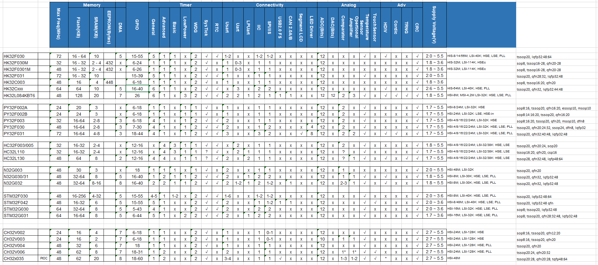

### MCU 32-bit  Review

Небольшой обзор 32-бит микроконтроллеров (хобби такое - не профессионал).<br>
(CH32, PY32, HC32, N32, AT32, GD32, STM32 ...)<br>
(RISC-V, Cortex-M0,M3,M4,M4F,M23,M33)

На первое время

```
boot - прошивки из микроконтроллеров
bin  - прошивки найденные в микроконтроллерах в основной Flash

по возможности будут расшифровки ( постепенные )
```       
#### Подробный разбор по работе с PY32F002A ( F003, F030 )
отдельная статья [PY32F002A_003_030](./PY32F002A_003_030/README.md)

#### Характеристики младших моделей (CM0,CM0+,RV32EC,RV32IMAC)


#### Сравнение потребления из DS
